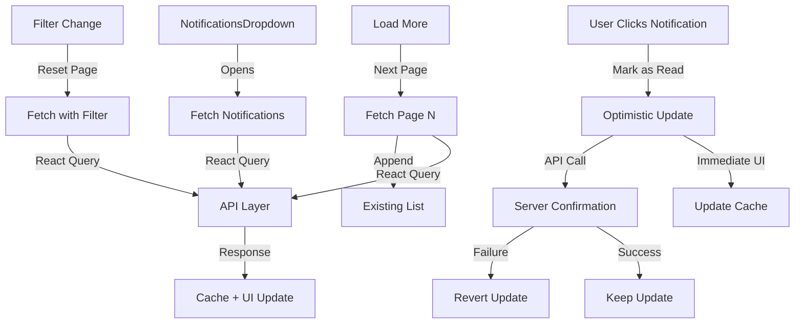

# Design Document: Notification System Enhancement

## Overview

This design document outlines the technical implementation for enhancing the existing notification system into a production-ready, scalable solution. The enhancement transforms basic notification display functionality into a comprehensive dropdown-based notification center with filtering, pagination, optimistic updates, and robust state management.

### Current State

The existing implementation provides:
- API layer with endpoints for fetching, marking as read, and deleting notifications
- Basic React Query hooks for data fetching
- Simple NotificationItem component
- Type definitions for Notification and NotificationFilters

### Enhancement Goals

The enhancement will add:
- Dropdown-based notification UI with bell icon and unread badge
- Filter tabs (All, Unread, Read) with state management
- Pagination support with "Load More" functionality
- Optimistic updates for mark as read operations
- Comprehensive loading, empty, and error states
- Confirmation dialogs for destructive actions
- Performance optimizations (React.memo, debouncing)
- Full accessibility support (keyboard navigation, ARIA labels)

### Design Principles

1. **Simplicity**: Reuse existing UI components and patterns
2. **Modularity**: Follow the established module structure (api/, hooks/, components/, types/)
3. **Performance**: Minimize re-renders and leverage React Query caching
4. **Accessibility**: Ensure keyboard navigation and screen reader support
5. **User Experience**: Provide clear feedback for all operations

## Architecture

### Component Hierarchy

```
NotificationsDropdown (Container)
├── DropdownMenuTrigger (Bell Icon + Badge)
├── DropdownMenuContent
│   ├── NotificationsHeader
│   │   ├── Title
│   │   ├── Mark All as Read Button
│   │   └── Clear All Button
│   ├── NotificationFilters (Tab Component)
│   │   ├── All Tab
│   │   ├── Unread Tab
│   │   └── Read Tab
│   ├── NotificationsList
│   │   ├── Loading State (Skeleton Loaders)
│   │   ├── Error State (with Retry)
│   │   ├── Empty State (Contextual Message)
│   │   └── NotificationItem[] (List of notifications)
│   └── LoadMoreButton (Pagination Control)
└── NotificationDialog (NEW - Form Submission Viewer)
    ├── Dialog Trigger (Controlled by NotificationItem click)
    ├── Dialog Content
    │   ├── Loading State (Skeleton)
    │   ├── Error State (with Retry)
    │   └── FormDisplay Component (from forms module)
    └── Dialog Close Button
```

### Module Structure

```
src/modules/notifications/
├── api/
│   └── notifications.api.ts (Enhanced with pagination params)
├── hooks/
│   └── useNotifications.ts (Enhanced with pagination and filters)
├── components/
│   ├── NotificationsDropdown.tsx (NEW - Main container)
│   ├── NotificationsHeader.tsx (NEW - Header with actions)
│   ├── NotificationFilters.tsx (NEW - Filter tabs)
│   ├── NotificationsList.tsx (NEW - List with states)
│   ├── NotificationItem.tsx (Enhanced - Dialog trigger)
│   ├── NotificationDialog.tsx (NEW - Dialog with FormDisplay)
│   ├── NotificationSkeleton.tsx (NEW - Loading state)
│   ├── NotificationEmpty.tsx (NEW - Empty state)
│   └── DeleteAllDialog.tsx (NEW - Confirmation dialog)
├── utils/
│   └── extractFormSubmissionId.ts (NEW - URL parsing utility)
└── types/
    └── index.ts (Enhanced with pagination types)
```

### Data Flow



## Components and Interfaces

### 1. NotificationsDropdown Component

**Purpose**: Main container component that manages dropdown state and coordinates child components.

**Props**: None (self-contained)

**State**:
- `activeFilter`: 'all' | 'unread' | 'read' (default: 'all')
- Dropdown open/close state (managed by DropdownMenu)

**Responsibilities**:
- Render bell icon with unread count badge
- Manage dropdown open/close state
- Coordinate filter state with child components
- Provide context for notification operations

**Implementation Notes**:
- Uses shadcn/ui DropdownMenu component
- Bell icon from lucide-react
- Badge component for unread count
- Dropdown width: 400px (responsive on mobile)
- Position: align="end" to align with bell icon

### 2. NotificationsHeader Component

**Purpose**: Header section with title and action buttons.

**Props**:
```typescript
interface NotificationsHeaderProps {
  unreadCount: number;
  onMarkAllAsRead: () => void;
  onClearAll: () => void;
  isMarkingAllAsRead: boolean;
}
```

**Responsibilities**:
- Display "Notifications" title
- Render "Mark All as Read" button (disabled when no unread)
- Render "Clear All" button
- Show loading state on buttons during operations

**Implementation Notes**:
- Uses Button component with size="sm" and variant="ghost"
- Buttons disabled during loading states
- Flexbox layout: title on left, buttons on right

### 3. NotificationFilters Component

**Purpose**: Tab-based filter interface for All/Unread/Read.

**Props**:
```typescript
interface NotificationFiltersProps {
  activeFilter: 'all' | 'unread' | 'read';
  onFilterChange: (filter: 'all' | 'unread' | 'read') => void;
  counts: {
    all: number;
    unread: number;
    read: number;
  };
}
```

**Responsibilities**:
- Render three filter tabs
- Highlight active filter
- Display count for each filter
- Trigger filter change callback

**Implementation Notes**:
- Custom tab component (not shadcn/ui tabs)
- Active tab: border-b-2 border-primary
- Inactive tabs: text-muted-foreground
- Counts displayed in parentheses

### 4. NotificationsList Component

**Purpose**: Handles notification list rendering with loading, error, and empty states.

**Props**:
```typescript
interface NotificationsListProps {
  notifications: Notification[];
  isLoading: boolean;
  isError: boolean;
  error: Error | null;
  isEmpty: boolean;
  activeFilter: 'all' | 'unread' | 'read';
  onRetry: () => void;
}
```

**Responsibilities**:
- Render loading state (3 skeleton items)
- Render error state with retry button
- Render empty state with contextual message
- Render list of NotificationItem components
- Handle scroll container

**Implementation Notes**:
- Max height: 400px with overflow-y-auto
- Skeleton count: 3 items
- Empty state messages:
  - All: "No notifications yet"
  - Unread: "No unread notifications"
  - Read: "No read notifications"
- Error state: "Failed to load notifications" with retry button

### 5. NotificationItem Component (Enhanced)

**Purpose**: Individual notification display that triggers dialog on click.

**Props**:
```typescript
interface NotificationItemProps {
  notification: Notification;
  onNotificationClick: (notification: Notification) => void;
}
```

**Responsibilities**:
- Display notification title, message, and relative date
- Show unread indicator (background color or dot)
- Handle click to mark as read and trigger dialog
- Use React.memo for performance

**Implementation Notes**:
- Unread: bg-blue-50 border border-blue-200
- Read: bg-white
- Relative date formatting using date-fns or similar
- Click handler: mark as read (if unread) + call onNotificationClick callback
- Hover effect: bg-muted transition
- Does NOT navigate directly - delegates to parent component

**Date Formatting**:
- < 1 minute: "Just now"
- < 1 hour: "X minutes ago"
- < 24 hours: "X hours ago"
- < 7 days: "X days ago"
- >= 7 days: Formatted date (e.g., "Jan 15, 2024")

### 6. NotificationSkeleton Component

**Purpose**: Loading placeholder matching NotificationItem layout.

**Props**: None

**Responsibilities**:
- Render skeleton matching NotificationItem structure
- Animate pulse effect

**Implementation Notes**:
- Uses Skeleton component from shadcn/ui
- Three skeleton elements: title, message, date
- Height matches NotificationItem

### 7. NotificationEmpty Component

**Purpose**: Empty state display with contextual messaging.

**Props**:
```typescript
interface NotificationEmptyProps {
  filter: 'all' | 'unread' | 'read';
}
```

**Responsibilities**:
- Display contextual empty message based on filter
- Show icon (Bell icon with slash or similar)
- Use muted styling

**Implementation Notes**:
- Centered layout with icon and text
- Icon: BellOff from lucide-react
- Text color: text-muted-foreground

### 8. DeleteAllDialog Component

**Purpose**: Confirmation dialog for delete all action.

**Props**:
```typescript
interface DeleteAllDialogProps {
  open: boolean;
  onOpenChange: (open: boolean) => void;
  onConfirm: () => void;
  isDeleting: boolean;
}
```

**Responsibilities**:
- Display confirmation message
- Provide Cancel and Confirm buttons
- Show loading state during deletion

**Implementation Notes**:
- Uses Dialog component from shadcn/ui
- Title: "Delete all notifications?"
- Description: "This action cannot be undone. All notifications will be permanently deleted."
- Confirm button: variant="destructive"
- Cancel button: variant="outline"

### 9. NotificationDialog Component (NEW)

**Purpose**: Dialog that displays form submission details when a notification is clicked.

**Props**:
```typescript
interface NotificationDialogProps {
  open: boolean;
  onOpenChange: (open: boolean) => void;
  formSubmissionId: string | null;
}
```

**Responsibilities**:
- Manage dialog open/close state
- Extract form submission ID from notification URL
- Fetch form submission data using useGetFormById hook
- Display loading state while fetching
- Display error state if fetch fails
- Render FormDisplay component with fetched data
- Handle dialog close and cleanup

**Implementation Notes**:
- Uses Dialog component from shadcn/ui
- Dialog width: max-w-4xl (large dialog for form content)
- Only fetches data when dialog is open AND ID exists
- Loading state: Skeleton matching FormDisplay layout
- Error state: Error message with retry button
- FormDisplay component imported from `src/modules/forms/components/FormDisplay`
- useGetFormById hook imported from `src/modules/forms/hooks/useForms`

**State Management**:
- Dialog controlled by parent (NotificationsDropdown)
- Form data fetched on-demand (not preloaded)
- React Query handles caching (avoids refetch if same notification reopened)

**UX Flow**:
1. User clicks notification
2. Dropdown closes immediately
3. Dialog opens smoothly
4. Loading skeleton displays
5. Form data fetches
6. FormDisplay renders with data
7. User can close dialog to return to notifications

**Error Handling**:
```typescript
// If no valid ID
if (!formSubmissionId) {
  return null; // Don't render dialog
}

// If fetch fails
<div className="flex flex-col items-center justify-center p-8 gap-4">
  <AlertCircle className="h-12 w-12 text-muted-foreground" />
  <div className="text-center">
    <p className="text-sm font-medium">Failed to load form submission</p>
    <p className="text-xs text-muted-foreground">
      {error?.message || "Please try again"}
    </p>
  </div>
  <Button variant="outline" size="sm" onClick={() => refetch()}>
    Retry
  </Button>
</div>
```

### 10. LoadMoreButton Component

**Purpose**: Pagination control for loading additional notifications.

**Props**:
```typescript
interface LoadMoreButtonProps {
  onLoadMore: () => void;
  isLoading: boolean;
  hasMore: boolean;
}
```

**Responsibilities**:
- Display "Load More" button
- Show loading state
- Hide when no more pages

**Implementation Notes**:
- Uses Button component with variant="ghost"
- Full width button
- Loading state: "Loading..." with spinner
- Hidden when hasMore is false

## Data Models

### URL Parsing Utility

**File**: `src/modules/notifications/utils/extractFormSubmissionId.ts`

**Purpose**: Extract form submission ID from notification URL.

```typescript
/**
 * Extracts form submission ID from notification URL
 * Supports various URL formats:
 * - /forms/submissions/123
 * - /forms/123/view
 * - /submissions/123
 * - ?submissionId=123
 * 
 * @param url - The notification URL
 * @returns The extracted ID as a string, or null if not found
 */
export function extractFormSubmissionId(url: string): string | null {
  if (!url) return null;

  try {
    // Try to match common patterns
    const patterns = [
      /\/submissions\/(\d+)/,           // /submissions/123
      /\/forms\/submissions\/(\d+)/,    // /forms/submissions/123
      /\/forms\/(\d+)\/view/,           // /forms/123/view
      /submissionId=(\d+)/,             // ?submissionId=123
      /submission_id=(\d+)/,            // ?submission_id=123
    ];

    for (const pattern of patterns) {
      const match = url.match(pattern);
      if (match && match[1]) {
        return match[1];
      }
    }

    return null;
  } catch (error) {
    console.error('Error extracting form submission ID:', error);
    return null;
  }
}
```

**Usage**:
```typescript
const formId = extractFormSubmissionId(notification.url);
if (formId) {
  // Open dialog with form ID
  setSelectedFormId(formId);
  setDialogOpen(true);
}
```

### Enhanced Notification Type

```typescript
export interface Notification {
  id: number;
  title: string;
  message: string;
  type?: string;
  is_read: boolean;
  created_at: string;
  updated_at?: string;
  url: string;
}
```

No changes to the existing Notification type.

### Enhanced NotificationFilters Type

```typescript
export interface NotificationFilters {
  is_read?: 'true' | 'false'; // Changed from unread/read to is_read
  page?: number;
  per_page?: number;
}
```

**Changes**:
- Replaced `unread` and `read` with single `is_read` parameter
- Added `page` and `per_page` for pagination
- `is_read` values: 'true' for read, 'false' for unread, undefined for all

### Pagination Response

```typescript
export interface Pagination {
  total: number;
  count: number;
  per_page: number;
  current_page: number;
  total_pages: number;
}
```

Already exists in `src/types/types.ts`.

### API Response Types

```typescript
export interface GetNotificationsResponse {
  data: Notification[];
  pagination: Pagination;
  message: string;
}

export interface NotificationActionResponse {
  message: string;
  status: number;
}
```

Already exists in API layer.

### Hook State Types

```typescript
interface UseNotificationsResult {
  notifications: Notification[];
  pagination: Pagination | undefined;
  isLoading: boolean;
  isError: boolean;
  error: Error | null;
  refetch: () => void;
}

interface UseInfiniteNotificationsResult {
  notifications: Notification[];
  isLoading: boolean;
  isError: boolean;
  error: Error | null;
  hasNextPage: boolean;
  fetchNextPage: () => void;
  isFetchingNextPage: boolean;
}
```

## API Integration

### Enhanced API Layer

**File**: `src/modules/notifications/api/notifications.api.ts`

**Changes**:
1. Update `NotificationFilters` interface to include pagination
2. Ensure API calls pass pagination parameters correctly

```typescript
export interface NotificationFilters {
  is_read?: 'true' | 'false';
  page?: number;
  per_page?: number;
}

export const NotificationAPI = {
  getNotifications: (filters: NotificationFilters = {}) =>
    api.get<GetNotificationsResponse>("/notifications", { params: filters }),
  
  markAllAsRead: () =>
    api.post<NotificationActionResponse>("/notifications/mark-all-read"),
  
  deleteAll: () =>
    api.delete<NotificationActionResponse>("/notifications/delete-all"),
  
  markAsRead: (id: number | string) =>
    api.post<NotificationActionResponse>(`/notifications/${id}/read`),
};
```

### API Request Examples

**Fetch all notifications (page 1)**:
```
GET /notifications?page=1&per_page=10
```

**Fetch unread notifications**:
```
GET /notifications?is_read=false&page=1&per_page=10
```

**Fetch read notifications**:
```
GET /notifications?is_read=true&page=1&per_page=10
```

**Mark notification as read**:
```
POST /notifications/{id}/read
```

**Mark all as read**:
```
POST /notifications/mark-all-read
```

**Delete all notifications**:
```
DELETE /notifications/delete-all
```

## State Management

### React Query Hooks

**File**: `src/modules/notifications/hooks/useNotifications.ts`

#### 1. useNotifications Hook (Enhanced)

```typescript
export const useNotifications = (filters: NotificationFilters = {}) => {
  return useQuery({
    queryKey: ["notifications", filters],
    queryFn: () => NotificationAPI.getNotifications(filters),
    refetchInterval: 30000, // auto refresh every 30s
    staleTime: 10000, // consider data stale after 10s
  });
};
```

**Key Features**:
- Query key includes filters for proper caching
- Auto-refetch every 30 seconds
- Stale time of 10 seconds

#### 2. useInfiniteNotifications Hook (NEW)

```typescript
export const useInfiniteNotifications = (
  filter: 'all' | 'unread' | 'read'
) => {
  const filters: NotificationFilters = {
    is_read: filter === 'all' ? undefined : filter === 'read' ? 'true' : 'false',
    per_page: 10,
  };

  return useInfiniteQuery({
    queryKey: ["notifications", "infinite", filter],
    queryFn: ({ pageParam = 1 }) =>
      NotificationAPI.getNotifications({ ...filters, page: pageParam }),
    getNextPageParam: (lastPage) => {
      const { current_page, total_pages } = lastPage.pagination;
      return current_page < total_pages ? current_page + 1 : undefined;
    },
    initialPageParam: 1,
    staleTime: 10000,
  });
};
```

**Key Features**:
- Uses `useInfiniteQuery` for pagination
- Automatically manages page parameters
- Returns `hasNextPage` and `fetchNextPage`
- Flattens pages into single notification array

#### 3. useMarkAsRead Hook (Enhanced with Optimistic Updates)

```typescript
export const useMarkAsRead = () => {
  const queryClient = useQueryClient();

  return useMutation({
    mutationFn: (id: number | string) => NotificationAPI.markAsRead(id),
    onMutate: async (id) => {
      // Cancel outgoing refetches
      await queryClient.cancelQueries({ queryKey: ["notifications"] });

      // Snapshot previous value
      const previousNotifications = queryClient.getQueriesData({
        queryKey: ["notifications"],
      });

      // Optimistically update all notification queries
      queryClient.setQueriesData(
        { queryKey: ["notifications"] },
        (old: any) => {
          if (!old?.data?.data) return old;
          return {
            ...old,
            data: {
              ...old.data,
              data: old.data.data.map((notification: Notification) =>
                notification.id === id
                  ? { ...notification, is_read: true }
                  : notification
              ),
            },
          };
        }
      );

      return { previousNotifications };
    },
    onError: (err, id, context) => {
      // Revert optimistic update on error
      if (context?.previousNotifications) {
        context.previousNotifications.forEach(([queryKey, data]) => {
          queryClient.setQueryData(queryKey, data);
        });
      }
    },
    onSettled: () => {
      // Refetch after mutation
      queryClient.invalidateQueries({ queryKey: ["notifications"] });
    },
  });
};
```

**Key Features**:
- Optimistic updates for immediate UI feedback
- Reverts on error
- Updates all notification queries in cache
- Invalidates queries after success

#### 4. useMarkAllAsRead Hook (Enhanced)

```typescript
export const useMarkAllAsRead = () => {
  const queryClient = useQueryClient();

  return useMutation({
    mutationFn: NotificationAPI.markAllAsRead,
    onSuccess: () => {
      queryClient.invalidateQueries({ queryKey: ["notifications"] });
    },
  });
};
```

#### 5. useDeleteAllNotifications Hook (Enhanced)

```typescript
export const useDeleteAllNotifications = () => {
  const queryClient = useQueryClient();

  return useMutation({
    mutationFn: NotificationAPI.deleteAll,
    onSuccess: () => {
      queryClient.invalidateQueries({ queryKey: ["notifications"] });
    },
  });
};
```

#### 6. useUnreadCount Hook (NEW)

```typescript
export const useUnreadCount = () => {
  const { data } = useNotifications({ is_read: 'false', per_page: 1 });
  return data?.pagination?.total ?? 0;
};
```

**Key Features**:
- Fetches only 1 notification to get total count
- Returns total unread count from pagination
- Efficient for badge display

### Cache Invalidation Strategy

**Invalidation Rules**:
1. **Mark as Read**: Invalidate all notification queries
2. **Mark All as Read**: Invalidate all notification queries
3. **Delete All**: Invalidate all notification queries
4. **Filter Change**: No invalidation (uses different query key)
5. **Pagination**: No invalidation (uses infinite query)

**Cache Keys**:
- `["notifications", filters]` - Standard query
- `["notifications", "infinite", filter]` - Infinite query
- Query keys include filter parameters for proper isolation

## UI/UX Patterns

### Dropdown Behavior

**Opening**:
- Click bell icon to open
- Dropdown appears below icon, aligned to right
- Focus moves to dropdown content
- Fetches notifications on open

**Closing**:
- Click outside dropdown
- Press Escape key
- Click notification (navigates and closes)
- Click bell icon again

**Positioning**:
- Desktop: 400px width, aligned to right edge of bell icon
- Mobile: Full width minus 2rem padding, centered

### Loading States

**Initial Load**:
- Display 3 skeleton items
- Skeleton matches NotificationItem layout
- Pulse animation

**Pagination Load**:
- "Load More" button shows "Loading..." text
- Spinner icon next to text
- Button disabled during load

**Action Load** (Mark All as Read, Delete All):
- Button shows loading state
- Button disabled during operation
- Text changes to "Loading..." or similar

### Empty States

**Contextual Messages**:
- All filter: "No notifications yet" + "You're all caught up!"
- Unread filter: "No unread notifications" + "You're all caught up!"
- Read filter: "No read notifications" + "Mark notifications as read to see them here"

**Visual Design**:
- Centered layout
- BellOff icon (muted color)
- Primary message (text-sm)
- Secondary message (text-xs, text-muted-foreground)

### Error States

**Fetch Error**:
- Error icon (AlertCircle from lucide-react)
- Message: "Failed to load notifications"
- Retry button (variant="outline", size="sm")

**Action Error** (Mark as Read, Delete All):
- Toast notification with error message
- Error persists for 5 seconds
- User can dismiss

### Visual Indicators

**Unread Notifications**:
- Background: bg-blue-50
- Border: border border-blue-200
- Optional: Blue dot indicator on left

**Read Notifications**:
- Background: bg-white
- No border
- Muted text color for date

**Hover State**:
- Background: bg-muted
- Smooth transition (150ms)
- Cursor: pointer

**Unread Badge**:
- Position: Absolute, top-right of bell icon
- Background: bg-destructive
- Text: text-destructive-foreground
- Size: Small (h-4 min-w-4)
- Border radius: rounded-full
- Max display: 99+ for counts over 99

### Date Formatting

**Relative Time Logic**:
```typescript
function formatRelativeTime(dateString: string): string {
  const date = new Date(dateString);
  const now = new Date();
  const diffInSeconds = Math.floor((now.getTime() - date.getTime()) / 1000);

  if (diffInSeconds < 60) return "Just now";
  if (diffInSeconds < 3600) return `${Math.floor(diffInSeconds / 60)} minutes ago`;
  if (diffInSeconds < 86400) return `${Math.floor(diffInSeconds / 3600)} hours ago`;
  if (diffInSeconds < 604800) return `${Math.floor(diffInSeconds / 86400)} days ago`;
  
  return date.toLocaleDateString('en-US', { month: 'short', day: 'numeric', year: 'numeric' });
}
```

**Implementation**:
- Use `date-fns` library for date manipulation
- Format on render (not stored)
- Update on re-render (handled by React Query refetch)

## Performance Optimizations

### React.memo Usage

**Components to Memoize**:
1. **NotificationItem**: Prevents re-render when other notifications change
2. **NotificationFilters**: Prevents re-render when notification list updates
3. **NotificationEmpty**: Static component, no need to re-render

**Memoization Strategy**:
```typescript
export const NotificationItem = React.memo(({ notification, onMarkAsRead }: NotificationItemProps) => {
  // Component implementation
}, (prevProps, nextProps) => {
  // Custom comparison: only re-render if notification changes
  return prevProps.notification.id === nextProps.notification.id &&
         prevProps.notification.is_read === nextProps.notification.is_read;
});
```

### Debouncing

**Filter Changes**:
- No debouncing needed (discrete tab clicks)
- Each filter change triggers immediate fetch

**Search** (if added in future):
- Debounce search input by 300ms
- Use `useDebounce` hook from `src/hooks/useDebounce.ts`

### React Query Caching

**Cache Configuration**:
- `staleTime`: 10 seconds (data considered fresh for 10s)
- `cacheTime`: 5 minutes (cache persists for 5 minutes after last use)
- `refetchInterval`: 30 seconds (auto-refetch every 30s when dropdown open)
- `refetchOnWindowFocus`: true (refetch when user returns to tab)

**Cache Optimization**:
- Separate query keys for different filters
- Infinite query for pagination (avoids refetching previous pages)
- Optimistic updates reduce perceived latency

### Preventing Unnecessary Re-renders

**Strategies**:
1. **Dropdown Closed**: Stop refetch interval when dropdown closed
2. **Stable Callbacks**: Use `useCallback` for event handlers
3. **Stable Filter State**: Memoize filter state to prevent unnecessary re-renders
4. **Query Key Stability**: Ensure query keys are stable (no inline objects)

**Implementation Example**:
```typescript
const handleFilterChange = useCallback((filter: FilterType) => {
  setActiveFilter(filter);
}, []);

const handleMarkAsRead = useCallback((id: number) => {
  markAsReadMutation.mutate(id);
}, [markAsReadMutation]);
```

### Bundle Size Optimization

**Code Splitting**:
- NotificationsDropdown can be lazy-loaded if not in header
- Dialog components lazy-loaded (only when opened)

**Tree Shaking**:
- Import only needed icons from lucide-react
- Import only needed date-fns functions

## Error Handling

### Error Types

1. **Network Errors**: Failed to connect to server
2. **API Errors**: Server returned error response (4xx, 5xx)
3. **Validation Errors**: Invalid data format
4. **Timeout Errors**: Request took too long

### Error Handling Strategy

**Fetch Errors**:
```typescript
if (isError) {
  return (
    <div className="flex flex-col items-center justify-center p-8 gap-4">
      <AlertCircle className="h-12 w-12 text-muted-foreground" />
      <div className="text-center">
        <p className="text-sm font-medium">Failed to load notifications</p>
        <p className="text-xs text-muted-foreground">
          {error?.message || "Please try again"}
        </p>
      </div>
      <Button variant="outline" size="sm" onClick={() => refetch()}>
        Retry
      </Button>
    </div>
  );
}
```

**Mutation Errors**:
```typescript
const { mutate: markAllAsRead } = useMarkAllAsRead({
  onError: (error) => {
    toast.error("Failed to mark all as read", {
      description: error.message || "Please try again",
    });
  },
  onSuccess: () => {
    toast.success("All notifications marked as read");
  },
});
```

**Optimistic Update Errors**:
- Automatically reverted by React Query
- Show error toast to user
- User can retry action

### User-Friendly Error Messages

**Message Mapping**:
- Network error: "Unable to connect. Please check your internet connection."
- 401 Unauthorized: "Session expired. Please log in again."
- 403 Forbidden: "You don't have permission to perform this action."
- 404 Not Found: "Notification not found."
- 500 Server Error: "Something went wrong on our end. Please try again later."
- Timeout: "Request timed out. Please try again."

**Implementation**:
```typescript
function getErrorMessage(error: Error | ApiError): string {
  if (error instanceof ApiError) {
    switch (error.status) {
      case 401: return "Session expired. Please log in again.";
      case 403: return "You don't have permission to perform this action.";
      case 404: return "Notification not found.";
      case 500: return "Something went wrong on our end. Please try again later.";
      default: return error.message || "An error occurred";
    }
  }
  return "Unable to connect. Please check your internet connection.";
}
```

### Retry Logic

**Automatic Retry**:
- React Query automatically retries failed queries 3 times
- Exponential backoff: 1s, 2s, 4s

**Manual Retry**:
- Retry button in error state
- Calls `refetch()` from React Query
- Shows loading state during retry

## Testing Strategy

### Unit Testing

**Test Framework**: Vitest + React Testing Library

**Components to Test**:
1. **NotificationItem**:
   - Renders notification data correctly
   - Shows unread indicator when is_read is false
   - Calls onMarkAsRead when clicked
   - Formats date correctly
   - Navigates to notification URL

2. **NotificationFilters**:
   - Renders all three filter tabs
   - Highlights active filter
   - Calls onFilterChange when tab clicked
   - Displays counts correctly

3. **NotificationsList**:
   - Shows loading state when isLoading is true
   - Shows error state when isError is true
   - Shows empty state when isEmpty is true
   - Renders notification items when data available
   - Calls onRetry when retry button clicked

4. **NotificationsHeader**:
   - Renders title and buttons
   - Disables "Mark All as Read" when no unread
   - Shows loading state on buttons
   - Calls callbacks when buttons clicked

5. **DeleteAllDialog**:
   - Renders confirmation message
   - Calls onConfirm when confirmed
   - Closes when cancelled
   - Shows loading state during deletion

**Hook Testing**:
1. **useNotifications**:
   - Fetches notifications with correct filters
   - Returns loading state
   - Returns error state
   - Caches results correctly

2. **useMarkAsRead**:
   - Calls API with correct ID
   - Performs optimistic update
   - Reverts on error
   - Invalidates cache on success

3. **useInfiniteNotifications**:
   - Fetches first page
   - Fetches next page when requested
   - Returns hasNextPage correctly
   - Flattens pages correctly

### Integration Testing

**Scenarios to Test**:
1. **Complete Notification Flow**:
   - Open dropdown
   - View notifications
   - Click notification
   - Mark as read
   - Navigate to URL

2. **Filter Flow**:
   - Switch between filters
   - Verify correct notifications displayed
   - Verify counts update

3. **Pagination Flow**:
   - Load initial page
   - Click "Load More"
   - Verify new notifications appended
   - Verify "Load More" hidden when no more pages

4. **Mark All as Read Flow**:
   - Click "Mark All as Read"
   - Verify all notifications marked as read
   - Verify unread count updates to 0

5. **Delete All Flow**:
   - Click "Clear All"
   - Confirm deletion
   - Verify empty state displayed
   - Verify unread count updates to 0

### Property-Based Testing

Property-based testing will be configured using `fast-check` library with minimum 100 iterations per test.


## Correctness Properties

A property is a characteristic or behavior that should hold true across all valid executions of a system—essentially, a formal statement about what the system should do. Properties serve as the bridge between human-readable specifications and machine-verifiable correctness guarantees.

### Property 1: Unread Badge Display

For any unread count greater than zero, the notification dropdown should display a badge showing that count.

**Validates: Requirements 1.2**

### Property 2: Dropdown Toggle Behavior

For any dropdown state, clicking the bell icon should toggle the dropdown (open if closed, close if open).

**Validates: Requirements 1.3**

### Property 3: Click Outside to Close

For any open dropdown, clicking outside the dropdown area should close it.

**Validates: Requirements 1.4**

### Property 4: Notification Item Content Display

For any notification, the NotificationItem component should display the notification's title, message, and formatted date.

**Validates: Requirements 2.1**

### Property 5: Read/Unread Visual Differentiation

For any notification, the NotificationItem should display distinct visual styling based on its is_read status (unread notifications have highlighted background, read notifications have muted styling).

**Validates: Requirements 2.2, 2.3**

### Property 6: Relative Date Formatting

For any notification date, the system should format it as relative time (e.g., "2 hours ago", "yesterday") following the specified time ranges.

**Validates: Requirements 2.4**

### Property 7: Hover Effect on Notification Items

For any notification item, hovering over it should apply a hover effect (background color change).

**Validates: Requirements 2.5**

### Property 8: Optimistic Update on Click

For any unread notification, clicking it should immediately update the UI to show it as read (optimistic update) before the server responds.

**Validates: Requirements 3.1, 3.3**

### Property 9: Navigation on Click

For any notification, clicking it should navigate to the notification's URL.

**Validates: Requirements 3.2**

### Property 10: Filter Fetch Behavior

For any filter tab (All, Unread, Read), clicking it should fetch and display notifications matching that filter.

**Validates: Requirements 4.2**

### Property 11: Active Filter Visual Indication

For any active filter, the filter tab should have distinct visual styling to indicate it is selected.

**Validates: Requirements 4.3**

### Property 12: Pagination Reset on Filter Change

For any filter change, the system should reset pagination to page 1.

**Validates: Requirements 4.4**

### Property 13: Load More Fetches Next Page

For any notification list with additional pages available, clicking "Load More" should fetch the next page of notifications.

**Validates: Requirements 5.3**

### Property 14: Append Without Refetch

For any pagination operation, newly loaded notifications should be appended to the existing list without refetching previous pages.

**Validates: Requirements 5.4**

### Property 15: Load More Button Visibility

For any notification list, the "Load More" button should be visible when there are more pages available and hidden when all notifications have been loaded.

**Validates: Requirements 5.2, 5.5**

### Property 16: Pagination Loading Indicator

For any pagination operation in progress, the system should display a loading indicator.

**Validates: Requirements 5.6, 8.4**

### Property 17: Mark All as Read API Call

For any "Mark All as Read" button click, the system should send a request to the mark all as read endpoint.

**Validates: Requirements 6.2**

### Property 18: Mark All as Read Success Behavior

For any successful mark all as read operation, all displayed notifications should be updated to read status and the unread count should become zero.

**Validates: Requirements 6.3, 6.4**

### Property 19: Mark All as Read Loading State

For any mark all as read operation in progress, the button should display a loading state.

**Validates: Requirements 6.5**

### Property 20: Clear All Confirmation Dialog

For any "Clear All" button click, the system should display a confirmation dialog before proceeding.

**Validates: Requirements 7.2**

### Property 21: Confirmation Required for Deletion

For any delete all operation, the action should not proceed without explicit user confirmation in the dialog.

**Validates: Requirements 7.3**

### Property 22: Delete All API Call on Confirmation

For any confirmed delete all action, the system should send a request to the delete all endpoint.

**Validates: Requirements 7.4**

### Property 23: Empty State After Deletion

For any successful delete all operation, the dropdown should display an empty state message.

**Validates: Requirements 7.5**

### Property 24: Loading State Display

For any fetch operation in progress (initial load or pagination), the system should display appropriate loading indicators (skeletons for initial load, spinner for pagination).

**Validates: Requirements 8.1**

### Property 25: Prevent Duplicate Requests

For any fetch operation in progress, the system should prevent duplicate requests from being triggered.

**Validates: Requirements 8.5**

### Property 26: Empty State Display

For any empty notification list, the dropdown should display an empty state message.

**Validates: Requirements 9.1**

### Property 27: Contextual Empty State Messages

For any empty notification list, the empty state message should be contextual to the active filter (different messages for All, Unread, and Read filters).

**Validates: Requirements 9.2**

### Property 28: Error Display on Fetch Failure

For any failed fetch operation, the system should display an error message.

**Validates: Requirements 10.1, 10.2, 10.3**

### Property 29: Retry Option on Error

For any fetch error, the system should provide a retry button that allows the user to retry the operation.

**Validates: Requirements 10.5**

### Property 30: Hook Parameter Acceptance

For any call to useNotifications hook, it should accept filter and pagination parameters and pass them to the API.

**Validates: Requirements 11.3**

### Property 31: Cache Invalidation on Mutation Success

For any successful mutation (mark as read, mark all as read, delete all), the system should invalidate relevant React Query cache entries.

**Validates: Requirements 11.4**

### Property 32: Touch Target Minimum Size

For any interactive element in the notification dropdown, it should have a minimum tap target size of 44x44 pixels for touch-friendly interaction.

**Validates: Requirements 12.2**

### Property 33: No Re-renders When Closed

For any closed dropdown, changes to notification data should not trigger re-renders of the dropdown components.

**Validates: Requirements 13.2**

### Property 34: Cache Prevents Refetch

For any fresh data in React Query cache (within staleTime), the system should not refetch the data when the same query is made.

**Validates: Requirements 13.4**

### Property 35: Keyboard Navigation Support

For any notification dropdown, it should be navigable using Tab, Enter, and Escape keys.

**Validates: Requirements 14.1**

### Property 36: Escape Key Closes Dropdown

For any open dropdown, pressing the Escape key should close it.

**Validates: Requirements 14.2**

### Property 37: ARIA Labels on Notification Items

For any notification item, it should have appropriate ARIA roles and labels for screen reader accessibility.

**Validates: Requirements 14.5**


## Testing Strategy

### Overview

The testing strategy employs a dual approach combining unit tests and property-based tests to ensure comprehensive coverage. Unit tests verify specific examples, edge cases, and integration points, while property-based tests validate universal properties across all inputs. Together, they provide both concrete validation and general correctness guarantees.

### Property-Based Testing

**Library**: fast-check (JavaScript/TypeScript property-based testing library)

**Configuration**:
- Minimum 100 iterations per property test
- Each test tagged with feature name and property reference
- Tag format: `Feature: notification-system-enhancement, Property {number}: {property_text}`

**Property Test Examples**:

```typescript
import fc from 'fast-check';
import { describe, it, expect } from 'vitest';

// Feature: notification-system-enhancement, Property 1: Unread Badge Display
describe('Property 1: Unread Badge Display', () => {
  it('should display badge for any unread count > 0', () => {
    fc.assert(
      fc.property(
        fc.integer({ min: 1, max: 999 }), // Generate unread counts
        (unreadCount) => {
          const { getByTestId } = render(<NotificationsDropdown unreadCount={unreadCount} />);
          const badge = getByTestId('unread-badge');
          expect(badge).toBeInTheDocument();
          expect(badge).toHaveTextContent(unreadCount.toString());
        }
      ),
      { numRuns: 100 }
    );
  });
});

// Feature: notification-system-enhancement, Property 4: Notification Item Content Display
describe('Property 4: Notification Item Content Display', () => {
  it('should display title, message, and date for any notification', () => {
    fc.assert(
      fc.property(
        fc.record({
          id: fc.integer(),
          title: fc.string({ minLength: 1 }),
          message: fc.string({ minLength: 1 }),
          created_at: fc.date().map(d => d.toISOString()),
          is_read: fc.boolean(),
          url: fc.webUrl(),
        }),
        (notification) => {
          const { getByText } = render(<NotificationItem notification={notification} />);
          expect(getByText(notification.title)).toBeInTheDocument();
          expect(getByText(notification.message)).toBeInTheDocument();
          // Date should be formatted and displayed
          expect(document.body).toHaveTextContent(/ago|Just now|yesterday/i);
        }
      ),
      { numRuns: 100 }
    );
  });
});

// Feature: notification-system-enhancement, Property 6: Relative Date Formatting
describe('Property 6: Relative Date Formatting', () => {
  it('should format any date as relative time', () => {
    fc.assert(
      fc.property(
        fc.date({ min: new Date('2020-01-01'), max: new Date() }),
        (date) => {
          const formatted = formatRelativeTime(date.toISOString());
          const validFormats = [
            /Just now/,
            /\d+ minutes? ago/,
            /\d+ hours? ago/,
            /\d+ days? ago/,
            /\w+ \d+, \d{4}/, // e.g., "Jan 15, 2024"
          ];
          expect(validFormats.some(regex => regex.test(formatted))).toBe(true);
        }
      ),
      { numRuns: 100 }
    );
  });
});

// Feature: notification-system-enhancement, Property 14: Append Without Refetch
describe('Property 14: Append Without Refetch', () => {
  it('should append new notifications without refetching previous pages', () => {
    fc.assert(
      fc.property(
        fc.array(fc.record({
          id: fc.integer(),
          title: fc.string(),
          message: fc.string(),
          created_at: fc.date().map(d => d.toISOString()),
          is_read: fc.boolean(),
          url: fc.webUrl(),
        }), { minLength: 10, maxLength: 20 }),
        (notifications) => {
          const firstPage = notifications.slice(0, 10);
          const secondPage = notifications.slice(10);
          
          // Mock API to track calls
          const apiCalls: number[] = [];
          mockAPI.getNotifications.mockImplementation((filters) => {
            apiCalls.push(filters.page);
            return filters.page === 1 ? firstPage : secondPage;
          });
          
          const { result } = renderHook(() => useInfiniteNotifications('all'));
          
          // Load first page
          waitFor(() => expect(result.current.notifications).toHaveLength(10));
          
          // Load second page
          act(() => result.current.fetchNextPage());
          waitFor(() => expect(result.current.notifications).toHaveLength(notifications.length));
          
          // Verify page 1 was only called once
          expect(apiCalls.filter(p => p === 1)).toHaveLength(1);
        }
      ),
      { numRuns: 100 }
    );
  });
});
```

**Property Test Coverage**:
- All 37 correctness properties will have corresponding property-based tests
- Each test generates random inputs within valid ranges
- Tests verify properties hold across all generated inputs
- Minimum 100 iterations ensures statistical confidence

### Unit Testing

**Framework**: Vitest + React Testing Library

**Focus Areas**:
1. Specific examples and edge cases
2. Integration between components
3. Error conditions and boundary cases
4. UI interactions and state transitions

**Unit Test Examples**:

```typescript
import { describe, it, expect, vi } from 'vitest';
import { render, screen, fireEvent, waitFor } from '@testing-library/react';

describe('NotificationsDropdown', () => {
  it('should display bell icon on mount', () => {
    render(<NotificationsDropdown />);
    expect(screen.getByTestId('bell-icon')).toBeInTheDocument();
  });

  it('should display 3 filter tabs: All, Unread, Read', () => {
    render(<NotificationsDropdown />);
    expect(screen.getByText('All')).toBeInTheDocument();
    expect(screen.getByText('Unread')).toBeInTheDocument();
    expect(screen.getByText('Read')).toBeInTheDocument();
  });

  it('should default to "All" filter', () => {
    render(<NotificationsDropdown />);
    const allTab = screen.getByText('All');
    expect(allTab).toHaveClass('border-primary'); // Active styling
  });

  it('should display 3 skeleton items during initial load', () => {
    render(<NotificationsList isLoading={true} notifications={[]} />);
    const skeletons = screen.getAllByTestId('notification-skeleton');
    expect(skeletons).toHaveLength(3);
  });

  it('should revert optimistic update on error', async () => {
    const notification = { id: 1, title: 'Test', is_read: false };
    const mockMarkAsRead = vi.fn().mockRejectedValue(new Error('API Error'));
    
    render(<NotificationItem notification={notification} onMarkAsRead={mockMarkAsRead} />);
    
    const item = screen.getByText('Test');
    fireEvent.click(item);
    
    // Should show as read immediately (optimistic)
    await waitFor(() => expect(item.closest('div')).toHaveClass('bg-white'));
    
    // Should revert after error
    await waitFor(() => expect(item.closest('div')).toHaveClass('bg-blue-50'));
  });

  it('should display error message on delete failure', async () => {
    const mockDeleteAll = vi.fn().mockRejectedValue(new Error('Delete failed'));
    
    render(<NotificationsDropdown />);
    
    const clearButton = screen.getByText('Clear All');
    fireEvent.click(clearButton);
    
    const confirmButton = screen.getByText('Confirm');
    fireEvent.click(confirmButton);
    
    await waitFor(() => {
      expect(screen.getByText(/failed/i)).toBeInTheDocument();
    });
  });

  it('should render within 100ms of clicking bell icon', async () => {
    const startTime = performance.now();
    
    render(<NotificationsDropdown />);
    const bellIcon = screen.getByTestId('bell-icon');
    fireEvent.click(bellIcon);
    
    await waitFor(() => {
      expect(screen.getByTestId('dropdown-content')).toBeInTheDocument();
    });
    
    const endTime = performance.now();
    expect(endTime - startTime).toBeLessThan(100);
  });

  it('should have ARIA label on bell icon', () => {
    render(<NotificationsDropdown />);
    const bellIcon = screen.getByTestId('bell-icon');
    expect(bellIcon).toHaveAttribute('aria-label', 'Notifications');
  });

  it('should have ARIA attributes on unread badge', () => {
    render(<NotificationsDropdown unreadCount={5} />);
    const badge = screen.getByTestId('unread-badge');
    expect(badge).toHaveAttribute('aria-label', '5 unread notifications');
  });
});

describe('NotificationFilters', () => {
  it('should highlight active filter', () => {
    render(<NotificationFilters activeFilter="unread" onFilterChange={vi.fn()} />);
    const unreadTab = screen.getByText('Unread');
    expect(unreadTab).toHaveClass('border-primary');
  });

  it('should call onFilterChange when tab clicked', () => {
    const handleFilterChange = vi.fn();
    render(<NotificationFilters activeFilter="all" onFilterChange={handleFilterChange} />);
    
    const readTab = screen.getByText('Read');
    fireEvent.click(readTab);
    
    expect(handleFilterChange).toHaveBeenCalledWith('read');
  });
});

describe('NotificationsList', () => {
  it('should display contextual empty message for "All" filter', () => {
    render(<NotificationsList isEmpty={true} activeFilter="all" notifications={[]} />);
    expect(screen.getByText('No notifications yet')).toBeInTheDocument();
  });

  it('should display contextual empty message for "Unread" filter', () => {
    render(<NotificationsList isEmpty={true} activeFilter="unread" notifications={[]} />);
    expect(screen.getByText('No unread notifications')).toBeInTheDocument();
  });

  it('should display contextual empty message for "Read" filter', () => {
    render(<NotificationsList isEmpty={true} activeFilter="read" notifications={[]} />);
    expect(screen.getByText('No read notifications')).toBeInTheDocument();
  });

  it('should display error with retry button', () => {
    const handleRetry = vi.fn();
    render(
      <NotificationsList 
        isError={true} 
        error={new Error('Fetch failed')} 
        onRetry={handleRetry}
        notifications={[]}
      />
    );
    
    expect(screen.getByText(/failed to load/i)).toBeInTheDocument();
    
    const retryButton = screen.getByText('Retry');
    fireEvent.click(retryButton);
    
    expect(handleRetry).toHaveBeenCalled();
  });

  it('should include icon in empty state', () => {
    render(<NotificationEmpty filter="all" />);
    expect(screen.getByTestId('empty-icon')).toBeInTheDocument();
  });

  it('should use muted styling in empty state', () => {
    render(<NotificationEmpty filter="all" />);
    const message = screen.getByText(/no notifications/i);
    expect(message).toHaveClass('text-muted-foreground');
  });
});

describe('DeleteAllDialog', () => {
  it('should require confirmation before deletion', () => {
    const handleConfirm = vi.fn();
    render(
      <DeleteAllDialog 
        open={true} 
        onOpenChange={vi.fn()} 
        onConfirm={handleConfirm}
        isDeleting={false}
      />
    );
    
    // Dialog should be visible
    expect(screen.getByText(/delete all notifications/i)).toBeInTheDocument();
    
    // Confirm should not be called yet
    expect(handleConfirm).not.toHaveBeenCalled();
  });

  it('should call onConfirm when confirmed', () => {
    const handleConfirm = vi.fn();
    render(
      <DeleteAllDialog 
        open={true} 
        onOpenChange={vi.fn()} 
        onConfirm={handleConfirm}
        isDeleting={false}
      />
    );
    
    const confirmButton = screen.getByText('Confirm');
    fireEvent.click(confirmButton);
    
    expect(handleConfirm).toHaveBeenCalled();
  });

  it('should show loading state during deletion', () => {
    render(
      <DeleteAllDialog 
        open={true} 
        onOpenChange={vi.fn()} 
        onConfirm={vi.fn()}
        isDeleting={true}
      />
    );
    
    const confirmButton = screen.getByText(/loading/i);
    expect(confirmButton).toBeDisabled();
  });
});

describe('useNotifications hook', () => {
  it('should fetch notifications with filters', async () => {
    const { result } = renderHook(() => useNotifications({ is_read: 'false', page: 1 }));
    
    await waitFor(() => expect(result.current.isLoading).toBe(false));
    
    expect(mockAPI.getNotifications).toHaveBeenCalledWith({
      is_read: 'false',
      page: 1,
    });
  });

  it('should return loading state', () => {
    const { result } = renderHook(() => useNotifications());
    expect(result.current.isLoading).toBe(true);
  });

  it('should return error state on failure', async () => {
    mockAPI.getNotifications.mockRejectedValue(new Error('API Error'));
    
    const { result } = renderHook(() => useNotifications());
    
    await waitFor(() => expect(result.current.isError).toBe(true));
    expect(result.current.error).toBeTruthy();
  });
});

describe('useMarkAsRead hook', () => {
  it('should call API with correct ID', async () => {
    const { result } = renderHook(() => useMarkAsRead());
    
    act(() => result.current.mutate(123));
    
    await waitFor(() => expect(mockAPI.markAsRead).toHaveBeenCalledWith(123));
  });

  it('should invalidate cache on success', async () => {
    const queryClient = new QueryClient();
    const { result } = renderHook(() => useMarkAsRead(), {
      wrapper: ({ children }) => (
        <QueryClientProvider client={queryClient}>{children}</QueryClientProvider>
      ),
    });
    
    const invalidateSpy = vi.spyOn(queryClient, 'invalidateQueries');
    
    act(() => result.current.mutate(123));
    
    await waitFor(() => {
      expect(invalidateSpy).toHaveBeenCalledWith({ queryKey: ['notifications'] });
    });
  });
});
```

### Integration Testing

**Scenarios**:

1. **Complete Notification Flow**:
   - Open dropdown → View notifications → Click notification → Verify mark as read → Verify navigation

2. **Filter Flow**:
   - Switch between All/Unread/Read → Verify correct notifications displayed → Verify counts update

3. **Pagination Flow**:
   - Load initial page → Click "Load More" → Verify append behavior → Verify button hidden when done

4. **Mark All as Read Flow**:
   - Click "Mark All as Read" → Verify all marked as read → Verify unread count = 0

5. **Delete All Flow**:
   - Click "Clear All" → Confirm dialog → Verify deletion → Verify empty state

### Test Coverage Goals

- **Unit Tests**: 80%+ code coverage
- **Property Tests**: 100% of correctness properties covered
- **Integration Tests**: All major user flows covered
- **Accessibility Tests**: All ARIA requirements validated

### Testing Tools

- **Vitest**: Test runner and assertion library
- **React Testing Library**: Component testing
- **fast-check**: Property-based testing
- **MSW (Mock Service Worker)**: API mocking
- **@testing-library/user-event**: User interaction simulation
- **@axe-core/react**: Accessibility testing

### Continuous Integration

- Run all tests on every commit
- Fail build if any test fails
- Generate coverage reports
- Run property tests with 100 iterations minimum
- Run accessibility tests with axe-core

