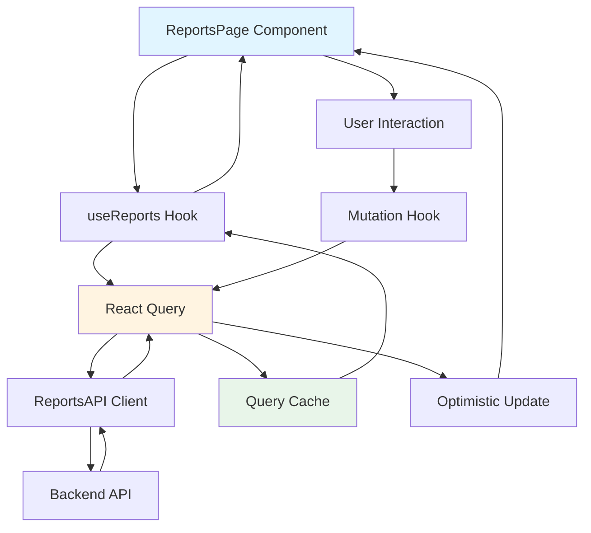
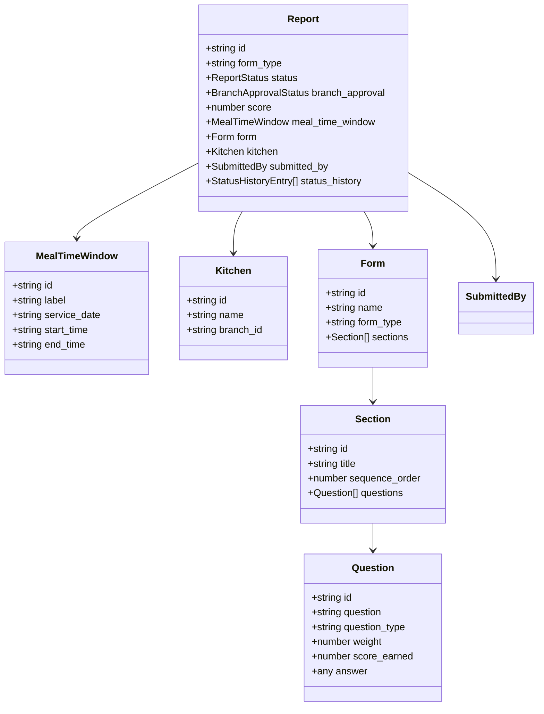

# Reports Module Design Document

## Overview

The Reports Module is a specialized view of the form-submissions system that focuses exclusively on report-type form submissions. It provides quality managers, supervisors, and branch managers with a dedicated interface to view, filter, and manage inspection reports for meal time windows across various kitchens.

This module follows the established architecture pattern of the form-submissions module, maintaining consistency in code structure, state management, and UI patterns. The key distinction is that this module filters for `form_type="report"` and provides a streamlined interface optimized for report management workflows.

### Key Features

- Paginated table view of report submissions with filtering capabilities
- Role-based access control for viewing and managing reports
- Branch approval workflow for branch managers
- Detailed report view with form sections, questions, and answers
- Real-time data caching and optimistic updates using React Query
- Full internationalization support (Arabic RTL and English LTR)
- Responsive design with mobile-friendly dialogs and tables

### Technology Stack

- **React 18** with TypeScript for type-safe component development
- **React Query (TanStack Query)** for server state management and caching
- **React Router** for navigation and route guards
- **i18next** for internationalization
- **Tailwind CSS** with shadcn/ui components for styling
- **Axios** for HTTP client with interceptors

## Architecture

### High-Level Structure

The Reports Module follows a feature-based architecture with clear separation of concerns:

```
src/modules/reports/
├── api/                    # API client layer
│   └── reports.api.ts      # HTTP requests to backend
├── types/                  # TypeScript type definitions
│   └── index.ts            # Report types and interfaces
├── hooks/                  # React Query hooks
│   └── useReports.ts       # Data fetching and mutations
├── components/             # React components
│   ├── ReportDialog.tsx    # View report details
│   ├── ReportDisplay.tsx   # Display report content
│   └── BranchApprovalDialog.tsx  # Approval workflow
└── pages/                  # Page-level components
    └── ReportsPage.tsx     # Main reports list page
```

### Data Flow



### State Management Strategy

The module uses a hybrid state management approach:

1. **Server State (React Query)**
   - Report list data with pagination
   - Individual report details
   - Filter-based query keys for granular cache control
   - Automatic background refetching and cache invalidation

2. **Local UI State (React Hooks)**
   - Dialog open/close states
   - Filter selections
   - Pagination state
   - Search input

3. **Global State (Zustand)**
   - User authentication and role information
   - Language preferences

## Components and Interfaces

### API Layer

#### ReportsAPI Client

```typescript
// src/modules/reports/api/reports.api.ts

export interface ReportFilters {
  search?: string;
  page?: number;
  per_page?: number;
  status?: string;
  form_id?: string;
  kitchen_id?: string;
  form_type: 'report';  // Always filter for reports
  date_from?: string;
  date_to?: string;
}

export interface GetReportsResponse {
  data: Report[];
  pagination: Pagination;
  message: string;
  status: number;
}

export const ReportsAPI = {
  // Get list of reports with filters
  getReports: (filters: ReportFilters = { form_type: 'report' }) =>
    api.get<GetReportsResponse>('/meal-time-windows/submissions', { 
      params: filters 
    }),

  // Get single report by ID
  getReportById: (id: string) =>
    api.get<ApiResponse<ReportResponse>>(`/form-submissions/${id}/show`),

  // Update branch approval status
  updateBranchApproval: (id: string, payload: BranchApprovalPayload) =>
    api.post<Report>(`/form-submissions/${id}/branch-approval`, payload),
};
```

### Hooks Layer

#### useReports Hook

```typescript
// src/modules/reports/hooks/useReports.ts

// Query Key Factory
export const queryKeys = {
  reports: (filters?: ReportFilters) => ['reports', filters] as const,
  report: (id: string) => ['report', id] as const,
};

// Queries
export const useGetReports = (filters?: ReportFilters) =>
  useQuery({
    queryKey: queryKeys.reports(filters),
    queryFn: () => ReportsAPI.getReports(filters),
  });

export const useGetReportById = (id: string) =>
  useQuery({
    queryKey: queryKeys.report(id),
    queryFn: () => ReportsAPI.getReportById(id),
    enabled: Boolean(id),
  });

// Mutations
export const useUpdateBranchApproval = () => {
  const queryClient = useQueryClient();
  
  return useMutation({
    mutationFn: ({ id, payload }: { 
      id: string; 
      payload: BranchApprovalPayload 
    }) => ReportsAPI.updateBranchApproval(id, payload),
    onSuccess: (_data, { id }) => {
      queryClient.invalidateQueries({ queryKey: ['reports'] });
      queryClient.invalidateQueries({ queryKey: ['report', id] });
    },
  });
};
```

### Component Layer

#### ReportsPage Component

The main page component that orchestrates the reports list view:

```typescript
// src/modules/reports/pages/ReportsPage.tsx

export function ReportsPage() {
  // State management
  const { dialog, openView, openApproval, close } = useDialogState<Report>();
  const { user } = useAuthStore();
  
  // Filters and pagination
  const {
    searchTerm,
    setSearchTerm,
    filters,
    setFilter,
    removeFilter,
    clearFilters,
    page,
    setPage,
    apiFilters,
  } = useAdvancedFilters();

  // Data fetching
  const { data: reportsData, isLoading } = useGetReports({
    ...apiFilters,
    form_type: 'report',  // Always filter for reports
  });

  // Table columns configuration
  const columns = useMemo<ColumnDef<Report>[]>(() => [
    // Column definitions...
  ], [t, user]);

  return (
    <div className="space-y-6">
      <PageHeader
        title={t('reports.title')}
        description={t('reports.subtitle')}
      />

      <AdvancedFilterSystem
        searchValue={searchTerm}
        onSearchChange={setSearchTerm}
        filters={filterConfigs}
        activeFilters={activeFilters}
        onFilterChange={setFilter}
        onFilterRemove={removeFilter}
        onClearAllFilters={clearFilters}
      />

      <DataTable
        columns={columns}
        data={reports}
        isLoading={isLoading}
        currentPage={page}
        totalPages={pagination?.total_pages ?? 0}
        onPageChange={setPage}
      />

      <ReportDialog
        open={dialog?.type === 'view'}
        report={dialog?.item}
        onOpenChange={close}
      />

      <BranchApprovalDialog
        open={dialog?.type === 'approval'}
        report={dialog?.item}
        onOpenChange={close}
      />
    </div>
  );
}
```

#### ReportDialog Component

Displays full report details in a modal dialog:

```typescript
// src/modules/reports/components/ReportDialog.tsx

interface ReportDialogProps {
  open: boolean;
  report: Report | null;
  onOpenChange: (open: boolean) => void;
}

export const ReportDialog: React.FC<ReportDialogProps> = ({
  open,
  report,
  onOpenChange,
}) => {
  const { t, i18n } = useTranslation();
  const isRTL = i18n.language === 'ar';

  return (
    <ActionDialog
      isOpen={open}
      onOpenChange={onOpenChange}
      cancelText={t('common.close')}
      footer={false}
      contentClassName="max-w-5xl max-h-[95vh] overflow-y-auto"
    >
      <div className="py-2 md:py-4" dir={isRTL ? 'rtl' : 'ltr'}>
        {report && <ReportDisplay data={report} />}
      </div>
    </ActionDialog>
  );
};
```

#### BranchApprovalDialog Component

Allows branch managers to approve or reject reports:

```typescript
// src/modules/reports/components/BranchApprovalDialog.tsx

interface BranchApprovalDialogProps {
  open: boolean;
  report: Report | null;
  onOpenChange: (open: boolean) => void;
}

export const BranchApprovalDialog: React.FC<BranchApprovalDialogProps> = ({
  open,
  report,
  onOpenChange,
}) => {
  const { t } = useTranslation();
  const [status, setStatus] = useState<BranchApprovalStatus>('pending');
  const [notes, setNotes] = useState('');
  
  const { mutate: updateApproval, isPending } = useUpdateBranchApproval();

  const handleSubmit = () => {
    if (!report) return;
    
    updateApproval(
      { 
        id: report.id, 
        payload: { 
          branch_approval: status, 
          branch_approval_notes: notes 
        } 
      },
      {
        onSuccess: () => {
          onOpenChange(false);
          setNotes('');
        },
      }
    );
  };

  return (
    <ActionDialog
      isOpen={open}
      onOpenChange={onOpenChange}
      title={t('reports.branchApproval')}
      confirmText={t('common.submit')}
      cancelText={t('common.cancel')}
      onConfirm={handleSubmit}
      isLoading={isPending}
    >
      {/* Approval form UI */}
    </ActionDialog>
  );
};
```

## Data Models

### Core Types

```typescript
// src/modules/reports/types/index.ts

export type ReportStatus =
  | 'under_supervisor_review'
  | 'under_manager_review'
  | 'under_quality_manager_review'
  | 'approved'
  | 'rejected';

export type BranchApprovalStatus = 'pending' | 'approved' | 'rejected';

export interface MealTimeWindow {
  id: string;
  label: string;
  service_date: string;
  start_time: string;
  end_time: string;
}

export interface Kitchen {
  id: string;
  name: string;
  branch_id: string;
}

export interface SubmittedBy {
  id: string;
  name: string;
  role: UserRole;
}

export interface StatusHistoryEntry {
  status: ReportStatus;
  changed_at: string;
  changed_by: SubmittedBy;
  notes?: string;
}

export interface Report {
  id: string;
  form_type: 'report';
  status: ReportStatus;
  branch_approval: BranchApprovalStatus;
  branch_approval_notes: string | null;
  inspection_date: string;
  score: number;
  meal_time_window: MealTimeWindow;
  form: Form;
  kitchen: Kitchen;
  submitted_by: SubmittedBy;
  status_history: StatusHistoryEntry[];
  created_at: string;
}

export interface ReportResponse {
  id: string;
  form_type: 'report';
  inspection_date: string;
  meal_time_window: string;
  score: number;
  status: string;
  branch_approval: string;
  branch_approval_notes: string;
  created_at: string;
  
  kitchen: {
    id: string;
    name: string;
  };

  submitted_by: {
    id: string;
    name: string;
    role: string;
  };

  status_history: {
    status: string;
    changed_at: string;
    notes?: string;
    changed_by: {
      id: string;
      name: string;
      role?: string;
    };
  }[];

  form: {
    id: string;
    name: string;
    description: string | null;
    form_type: 'report';
    is_active: boolean;
    created_at: string;
    
    sections: {
      id: string;
      title: string;
      description: string | null;
      sequence_order: number;
      
      questions: {
        id: string;
        question: string;
        question_type: 'text' | 'boolean' | 'single_select' | 'multi_select' | 'number';
        is_required: boolean;
        notes: string | null;
        sequence_order: number;
        weight: number;
        score_earned: number;
        options: any[];
        
        // Answers
        answer_text: string | null;
        answer_number: number | null;
        answer_boolean: boolean | null;
        answer_notes: string | null;
      }[];
    }[];
  };
}

export interface BranchApprovalPayload {
  branch_approval: BranchApprovalStatus;
  branch_approval_notes?: string;
}
```

### Type Relationships



## Error Handling

### Error Handling Strategy

The module implements a multi-layered error handling approach:

1. **API Layer Errors**
   - Axios interceptors catch HTTP errors
   - Transform error responses into user-friendly messages
   - Log errors to console for debugging

2. **React Query Error Handling**
   - Query errors are exposed through `isError` and `error` properties
   - Mutation errors trigger `onError` callbacks
   - Failed queries can be retried automatically

3. **Component-Level Error Handling**
   - Display error messages in UI using toast notifications
   - Show empty states when no data is available
   - Provide fallback UI for failed data fetches

### Error Scenarios

```typescript
// API Error Handler
const handleError = (error: AxiosError) => {
  if (axios.isAxiosError(error)) {
    const message = error.response?.data?.message || 'An error occurred';
    console.error('API Error:', message);
    return message;
  }
  console.error('Unknown error:', error);
  return 'An unexpected error occurred';
};

// Component Error Display
{isError && (
  <div className="text-center py-8">
    <p className="text-destructive">{t('reports.errorLoading')}</p>
    <Button onClick={() => refetch()} variant="outline" className="mt-4">
      {t('common.retry')}
    </Button>
  </div>
)}

// Empty State
{!isLoading && reports.length === 0 && (
  <div className="text-center py-12">
    <p className="text-muted-foreground">{t('reports.noReportsFound')}</p>
  </div>
)}
```

### Validation

```typescript
// Branch Approval Validation
const validateApproval = (status: BranchApprovalStatus, notes: string) => {
  if (status === 'rejected' && !notes.trim()) {
    return {
      isValid: false,
      error: t('reports.rejectionNotesRequired'),
    };
  }
  return { isValid: true };
};
```

## Testing Strategy

### Testing Approach

Since this module is primarily focused on UI rendering, data display, and CRUD operations without complex transformation logic, **Property-Based Testing (PBT) is not applicable**. The testing strategy will focus on:

1. **Unit Tests** - Test individual components and hooks in isolation
2. **Integration Tests** - Test component interactions and data flow
3. **End-to-End Tests** - Test complete user workflows

### Unit Testing

**Components to Test:**
- `ReportsPage` - Rendering, filtering, pagination
- `ReportDialog` - Display logic, RTL support
- `BranchApprovalDialog` - Form validation, submission
- `ReportDisplay` - Data formatting, score badges

**Hooks to Test:**
- `useReports` - Query key generation, cache invalidation
- `useUpdateBranchApproval` - Mutation logic, optimistic updates

**Test Examples:**

```typescript
// Component Test
describe('ReportsPage', () => {
  it('should display reports in table format', () => {
    const mockReports = [/* mock data */];
    render(<ReportsPage />);
    expect(screen.getByText(mockReports[0].form.name)).toBeInTheDocument();
  });

  it('should filter reports by kitchen', async () => {
    render(<ReportsPage />);
    const kitchenFilter = screen.getByLabelText('Kitchen');
    await userEvent.selectOptions(kitchenFilter, 'kitchen-1');
    expect(mockAPI.getReports).toHaveBeenCalledWith(
      expect.objectContaining({ kitchen_id: 'kitchen-1' })
    );
  });
});

// Hook Test
describe('useGetReports', () => {
  it('should fetch reports with filters', async () => {
    const { result } = renderHook(() => 
      useGetReports({ kitchen_id: 'kitchen-1', form_type: 'report' })
    );
    await waitFor(() => expect(result.current.isSuccess).toBe(true));
    expect(result.current.data).toBeDefined();
  });
});
```

### Integration Testing

**Scenarios to Test:**
- Complete approval workflow from list to dialog to submission
- Filter changes triggering API calls and cache updates
- Pagination navigation and data loading
- Role-based UI element visibility

```typescript
describe('Branch Approval Workflow', () => {
  it('should allow branch manager to approve report', async () => {
    const user = { role: 'branch_manager' };
    render(<ReportsPage />, { user });
    
    // Click approval button
    const approvalButton = screen.getByRole('button', { name: /approve/i });
    await userEvent.click(approvalButton);
    
    // Fill approval form
    const notesInput = screen.getByLabelText(/notes/i);
    await userEvent.type(notesInput, 'Approved');
    
    // Submit
    const submitButton = screen.getByRole('button', { name: /submit/i });
    await userEvent.click(submitButton);
    
    // Verify API call
    expect(mockAPI.updateBranchApproval).toHaveBeenCalledWith(
      expect.any(String),
      { branch_approval: 'approved', branch_approval_notes: 'Approved' }
    );
  });
});
```

### Test Coverage Goals

- **Components**: 80% coverage
- **Hooks**: 90% coverage
- **API Layer**: 100% coverage
- **Type Definitions**: Compile-time validation

### Testing Tools

- **Jest** - Test runner and assertion library
- **React Testing Library** - Component testing
- **MSW (Mock Service Worker)** - API mocking
- **Testing Library User Event** - User interaction simulation

## Implementation Notes

### File Structure

```
src/modules/reports/
├── api/
│   └── reports.api.ts              # API client (150 lines)
├── types/
│   └── index.ts                    # Type definitions (200 lines)
├── hooks/
│   └── useReports.ts               # React Query hooks (120 lines)
├── components/
│   ├── ReportDialog.tsx            # View dialog (80 lines)
│   ├── ReportDisplay.tsx           # Display component (250 lines)
│   └── BranchApprovalDialog.tsx    # Approval dialog (150 lines)
└── pages/
    └── ReportsPage.tsx             # Main page (300 lines)
```

### Dependencies

The module reuses existing shared components and utilities:
- `@/components/ui/data-table` - Table component
- `@/components/ui/action-dialog` - Modal dialogs
- `@/components/ui/badge` - Status badges
- `@/components/dashboard/AdvancedFilterSystem` - Filter UI
- `@/hooks/filter-systerm/useAdvancedFilters` - Filter state management
- `@/hooks/useDialogState` - Dialog state management
- `@/lib/api` - Axios instance with interceptors

### Internationalization Keys

New translation keys to add:

```json
{
  "reports": {
    "title": "Reports",
    "subtitle": "View and manage inspection reports",
    "noReportsFound": "No reports found",
    "errorLoading": "Error loading reports",
    "branchApproval": "Branch Approval",
    "rejectionNotesRequired": "Notes are required when rejecting a report",
    "mealTimeWindow": "Meal Time Window",
    "viewReport": "View Report",
    "approveReport": "Approve Report"
  }
}
```

### Role-Based Access Control

```typescript
// Role permissions matrix
const ROLE_PERMISSIONS = {
  system_manager: ['view_all', 'approve'],
  quality_manager: ['view_assigned', 'approve'],
  quality_supervisor: ['view_supervised', 'approve'],
  branch_manager: ['view_branch', 'approve'],
  project_manager: ['view_all'], // No approval column
  quality_inspector: ['view_own'],
};

// Usage in component
<RoleGuard allowedRoles={['branch_manager']}>
  <Button onClick={() => openApproval(report)}>
    {t('reports.approveReport')}
  </Button>
</RoleGuard>
```

### Performance Considerations

1. **Query Caching**
   - Cache reports list for 5 minutes
   - Cache individual reports for 10 minutes
   - Invalidate on mutations

2. **Pagination**
   - Default page size: 10 items
   - Prefetch next page on hover

3. **Filtering**
   - Debounce search input (300ms)
   - Memoize filter configurations
   - Use query key factory for granular cache control

4. **Code Splitting**
   - Lazy load dialog components
   - Split report display component

### Migration from Form Submissions

For users familiar with the form-submissions module:

1. **API Endpoint**: Uses `/meal-time-windows/submissions` instead of `/form-submissions`
2. **Filter**: Always includes `form_type: 'report'` in API calls
3. **Time Field**: Uses `meal_time_window` object instead of simple `time` field
4. **Simplified Actions**: No create/edit actions, only view and approve
5. **Focused Scope**: Only displays report-type submissions

